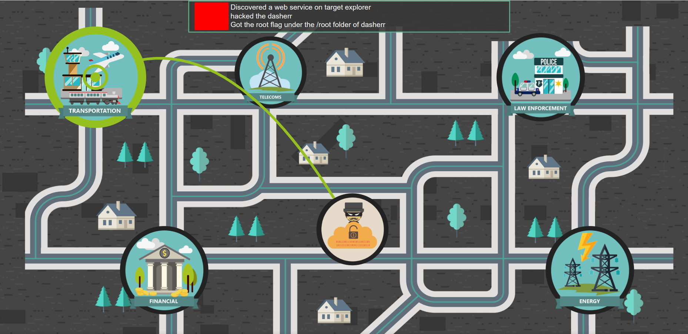
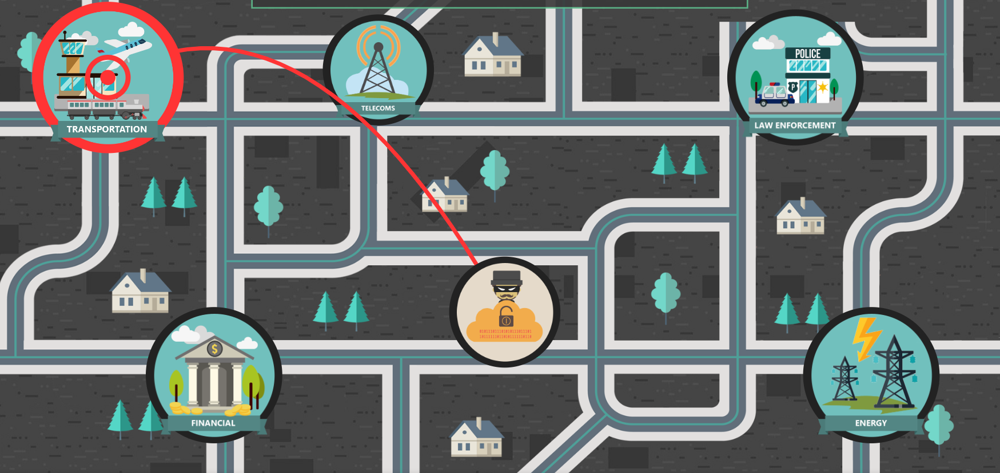
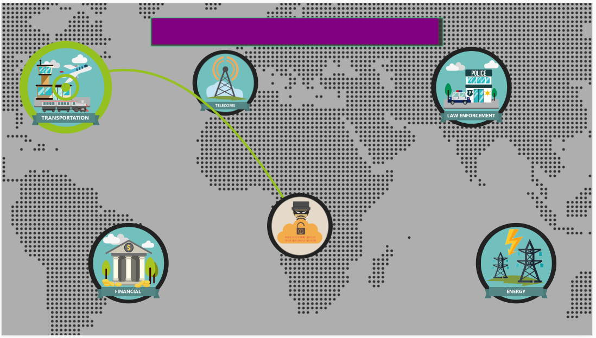

# [WIP] echoCTF Livecity
Visualize your echoCTF stream as actions on a virtual map overlay, from updates received through web sockets.

When there is activity towards an infrastructure target


When a target gets hacked on an infrastructure


Images and backgrounds can be modified to suit your own needs




## Configuration
```json
{
  "db_host": "localhost",
  "db_user": "root",
  "db_pass": "",
  "db_name": "echoCTF",
  "listenPort": 4000
}
```

## Test
Test from browser javascript console to trigger "fake" activity
```js
HandleNotifications({
  "id": 11,
  "model": "finding",
  "infrastructure_id": 1, // this must be an id from your backend infrastructure
  "username": "h4x0r",
  "title": "h4x0r Is getting started with <code>police</code>"
});
```
## TODO

* [ ] Update the javascript dependencies of the frontend (jquery, raphael)
* [ ] Make the infrastructure dynamic (pull information from the backend database)